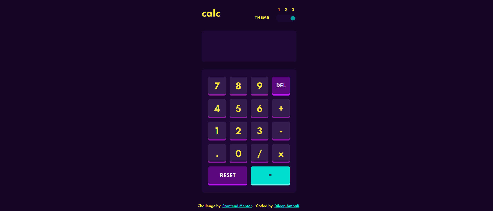

# Frontend Mentor - Calculator app solution

This is a solution to the [Calculator app challenge on Frontend Mentor](https://www.frontendmentor.io/challenges/calculator-app-9lteq5N29). Frontend Mentor challenges help you improve your coding skills by building realistic projects.

## Table of contents

-   [Overview](#overview)
    -   [The challenge](#the-challenge)
    -   [Screenshot](#screenshot)
-   [My process](#my-process)
    -   [Built with](#built-with)
    -   [What I learned](#what-i-learned)
-   [Acknowledgments](#acknowledgments)

## Overview

This is one of my first ever attempt at implementing javascript applications. The calculator app is a simple calculator that can perform basic arithmetic operations. The calculator is build using only HTML, CSS and JS. The calculator is responsive and can be used on any device. The calculator also has a theme that is set based on the user's preference.

### The challenge

Users should be able to:

-   See the size of the elements adjust based on their device's screen size
-   Perform mathmatical operations like addition, subtraction, multiplication, and division
-   Adjust the color theme based on their preference

### Screenshot




## My process

### Built with

-   Semantic HTML5 markup
-   CSS custom properties
-   Flexbox
-   CSS Grid
-   Mobile-first workflow
-   Vanilla JS

### What I learned

I learned how to use javascript to manipulate the DOM. I also learned how to use CSS variables to change the theme of the calculator. I also learned how to use CSS grid to layout the calculator. I also learned how to use CSS flexbox to layout the calculator.

The following code snippet shows how I set up the theme selector. I am really proud of this code because it is the first time I am using javascript to manipulate the DOM.

```html
<div class="selector">
	<input
		type="range"
		min="1"
		max="3"
		value="1"
		id="slider"
		oninput="change_theme()"
	/>
</div>
```

## Acknowledgments

I would like to thank Frontend Mentor for providing me with the design for this project. I would also like to thank the people at Frontend Mentor for providing me with the assets for this project.
